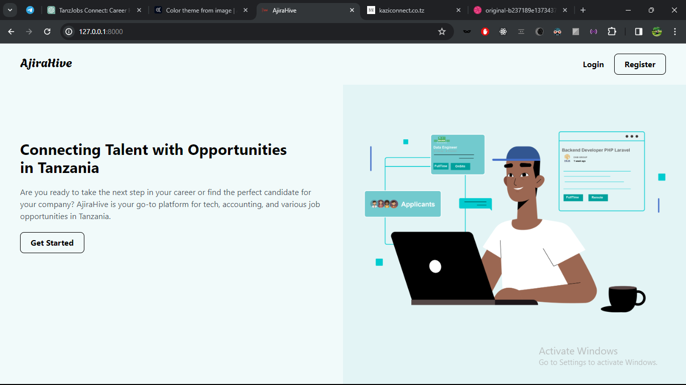

# AjiraHive Job Portal - In Development

## Empowering Careers, Enabling Growth in Tanzania

AjiraHive is a sophisticated web application developed with Laravel 10, utilizing Blade templates, and enhanced with the aesthetic appeal of Tailwind CSS. This platform acts as a central hub, connecting job seekers with promising career opportunities and assisting employers in finding top-tier talent within the Tanzanian job market.

### Key Features:

#### For Job Seekers:

-   **Explore Diverse Career Paths:**
    Browse through an extensive collection of job listings spanning various industries, from technology and accounting to finance, marketing, and more.

-   **Tailor Your Search:**
    Refine your job search with advanced filters to discover roles that align perfectly with your skills, experience, and career goals.

-   **Elevate Your Professional Profile:**
    Create a captivating professional profile to stand out to potential employers and increase your visibility in the Tanzanian job market.

#### For Employers:

-   **Effortless Job Postings:**
    Post job openings seamlessly with our user-friendly platform, ensuring your opportunities reach a vast pool of talented professionals.

-   **Access Top-Notch Talent:**
    Explore a curated selection of skilled professionals actively seeking opportunities in Tanzania and find the perfect fit for your team.

-   **Simplify Your Hiring Process:**
    Leverage AjiraHive's streamlined platform to simplify your hiring process, from posting jobs to reviewing applications.

### Why Choose AjiraHive:

#### Unparalleled Career Growth:

-   **Personalized Career Guidance:**
    Benefit from personalized career guidance and resources to make informed decisions about your professional journey.

-   **Networking Opportunities:**
    Connect with industry professionals, mentors, and like-minded individuals to expand your professional network and open doors to new possibilities.

#### Seamless User Experience:

-   **Intuitive Platform:**
    Navigate effortlessly through our platform, thanks to its intuitive design. Whether you're a seasoned professional or a first-time user, AjiraHive ensures a smooth experience.

-   **Mobile Accessibility:**
    Access AjiraHive anytime, anywhere, with our mobile-friendly interface. Stay connected to your career or hiring needs on the go.

#### Comprehensive Career Categories:

-   **Diverse Industry Coverage:**
    Our platform spans various industries, ensuring that you can find opportunities in sectors that match your skills and interests.

-   **Continuous Updates:**
    Stay informed about the latest job openings and industry trends with regular updates on AjiraHive. We're committed to keeping you in the loop.
